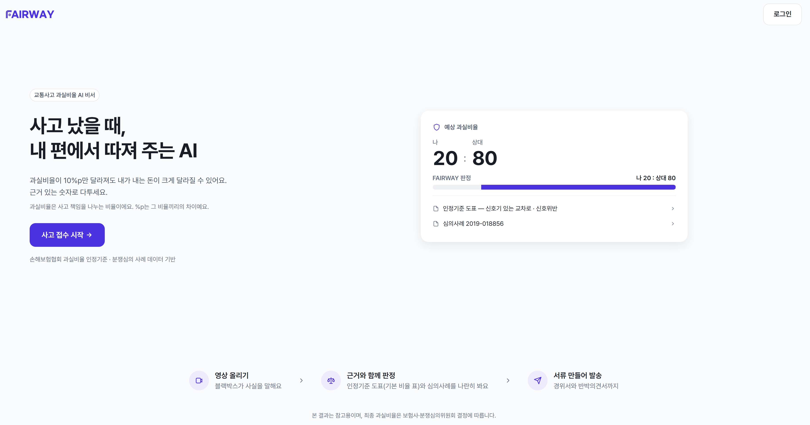
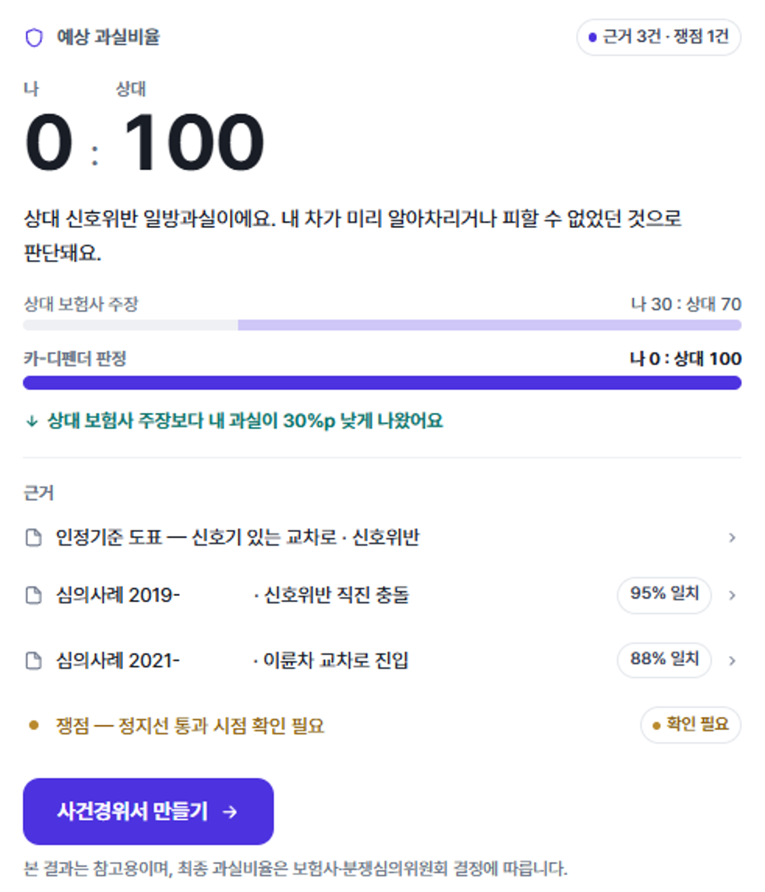

# 🚗 FAIRWAY : Car Defender

> 블랙박스 영상 분석부터 과실비율 확인, 보험 대응 문서 작성까지 지원하는 **Multi-Agent 기반 교통사고 대응 서비스**

<p align="center">
  
</p>

Car Defender(카-디펜더)는 교통사고 이후 필요한 정보 확인과 대응 과정을 하나의 대화형 서비스로 연결합니다. 역할별 AI Agent가 협업하여 사고 영상을 분석하고, 관련 근거를 탐색하며, 사용자의 사고 대응을 지원합니다.

<p align="center">
  
</p>

## ✨ 핵심 기능

| 기능 | 키워드 |
| --- | --- |
| 블랙박스 분석 | 영상 이해 · 사고 장면 인식 · 핵심 정보 추출 |
| 대화형 정보 확인 | 사용자 질의응답 · 사고 정보 보완 · 상태 관리 |
| 유사사례 검색 | RAG · 의미 기반 검색 · 판단 근거 제공 |
| 과실비율 분석 | 사고 맥락 분석 · 예상 비율 · 근거 중심 결과 |
| 보험 대응 문서 | 사건경위서 · 반박의견서 · PDF |
| 사건 관리 | 사건별 진행 상태 · 실시간 알림 · 기록 관리 |

## 🤖 AI Agent

Car Defender는 하나의 AI 모델에 모든 작업을 맡기지 않고, 각 영역에 특화된 Agent가 협업하는 구조로 설계했습니다.

- **Orchestration Agent** — 대화 · 상태 · 작업 조율
- **Vision Agent** — 블랙박스 영상 분석
- **Retrieval Agent** — 유사사례 및 근거 탐색
- **Document Agent** — 보험 대응 문서 작성

`Multi-Agent` · `Agent Orchestration` · `Multimodal AI` · `RAG` · `Prompt Engineering` · `Structured Output` · `Guardrail`

## 🔄 서비스 흐름

<p align="center">
  <strong>사고 접수</strong> →
  <strong>AI 영상 분석</strong> →
  <strong>대화형 정보 확인</strong> →
  <strong>근거 검색 및 결과 제공</strong> →
  <strong>보험 대응 문서 생성</strong>
</p>

## 🛠️ 기술 스택

| 영역 | 기술 |
| --- | --- |
| Backend | Python · FastAPI · Pydantic · SQLAlchemy |
| AI |  Multi-Agent |
| Retrieval | RAG · Embedding · Semantic Search |
| Database | PostgreSQL · SQLite · Alembic |
| Realtime | Server-Sent Events |
| Document | PDF Generation · Email |
| Infra | Docker · Nginx · AWS EC2 |
| Test | pytest · Ruff |

## 📁 프로젝트 구성

```text
Car-Defender/
├── ai/       # AI Agent · 영상 분석 · RAG · 문서 생성
├── server/   # API · 데이터 · 인증 · 실시간 처리
└── design/   # UI · 디자인 시스템 · 서비스 명세
```

## 🎯 기대 효과

- 복잡한 사고 정보를 대화형으로 정리
- 영상과 관련 사례를 활용한 판단 보조
- 사고 접수부터 보험 대응 문서까지 과정 연결
- 사용자 중심의 일관된 사고 대응 경험 제공


> 본 서비스의 분석 결과는 참고용이며, 보험사·분쟁심의위원회 또는 법률 전문가의 최종 판단을 대신하지 않습니다.
